# Test environment template
AWSアカウントに動作検証用の環境をデプロイするTerraformテンプレートです。

## Architecture


### 設定値と設計思想
#### Subnet
デプロイ対象リージョンで、利用可能なすべてのAvailability Zoneに均等にSubnetを配置します。

例えば、ap-northeast-1リージョンの場合、3つのAZが利用可能なため、

- Private subnet: 3つ
- Public subnet: 3つ

がデプロイされます。各Subnetに割り当てられるIPアドレス数は同一です。

#### Route table
各Subnetごとに、独立したRoute tableを割り当てています。

デフォルトのRoute tableは利用しない想定です。
(Nameタグを付与するため、Terraform管理下には置いています)

#### Gateway型VPC Endpoint
未利用時に課金が発生しないため、デフォルトで

- S3
- DynamoDB

用のEndpointを配置しています。

#### Interface型VPC Endpoint
デフォルトでは作成せず、Optionで作成が可能です。

作成する場合、1AZにのみInterface VPC Endpointを配置します。
本テンプレートは、動作検証環境のプロビジョニング用のため、冗長性よりもコスト効率を優先しました。

また、名前解決を含むすべての通信をVPC内で実行するため、Private DNSを有効化しています。

#### NAT Gatewway
デフォルトでは作成せず、Optionで作成が可能です。

作成する場合、1AZにのみNAT Gatewayを配置します。
本テンプレートは、動作検証環境のプロビジョニング用のため、冗長性よりもコスト効率を優先しました。

## Usage
各envの `main.tf`
```hcl
module "network" {
  source = "../../modules/network"

  env_name                         = "sample"
  vpc_cidr                         = "10.0.0.0/24"
  need_nat_gateway                 = true
  required_interface_vpc_endpoints = ["lambda", "kinesis"]
}
```

各variableの詳細は、[moduleのvariables.tf](./terraform/modules/network/variables.tf)を参照ください。
